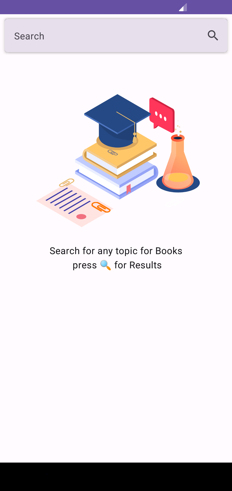
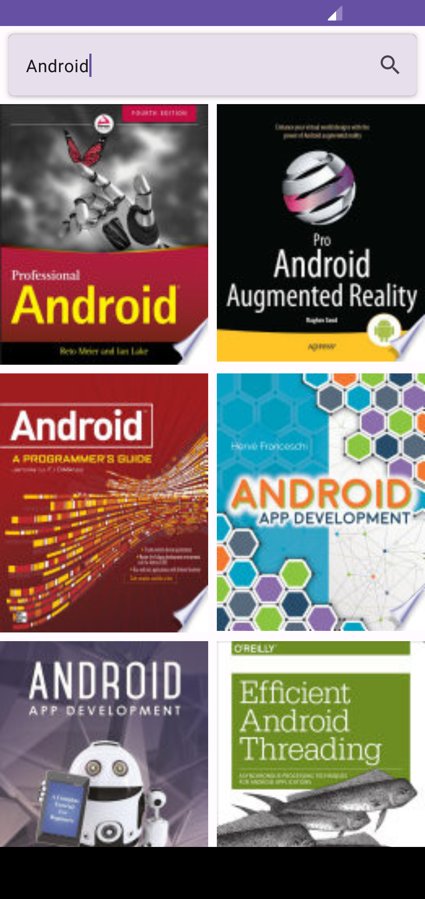
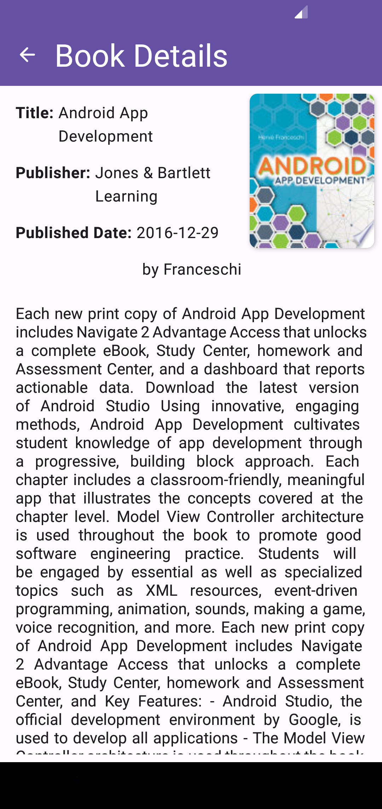

# BookShelf Android App

BookShelf is an Android app designed to provide users with a seamless and interactive book browsing experience. With this app, you can search for books using the Google Books API and view a curated list of 40 books based on your search query. Additionally, you can select a book from the list to view detailed information about it.

## Features

- **Book Search:** Search for books using keywords or book titles through the Google Books API.
- **Book List:** Browse a curated list of 40 books based on your search query.
- **Book Details:** View comprehensive details about each selected book, including title, author, description, ratings, and more.
- **Interactive User Interface:** Enjoy a user-friendly interface with smooth navigation and visually appealing book display.

## Screenshots

## Installation

1. Download the APK file from the [releases](https://github.com/Indresh10/BookShelf/releases) section of this repository.
2. Transfer the APK file to your Android device.
3. On your Android device, navigate to **Settings > Security** and enable **Unknown sources** to allow the installation of apps from sources other than the Play Store.
4. Use a file manager app to locate the APK file and tap on it to begin the installation.
5. Follow the on-screen instructions to install the BookShelf app on your device.
6. Once installed, you can find the app icon on your home screen or app drawer.

## Usage

1. Launch the BookShelf app by tapping on its icon.
2. On the home screen, enter a keyword or book title in the search bar to search for books.
3. Tap the search button or press Enter to initiate the search.
4. The app will retrieve a curated list of 40 books based on your search query.
5. Scroll through the list of books to find the one you're interested in.
6. Tap on a book to view detailed information about it, including title, author, description, ratings, and more.
7. Explore the book details and enjoy a comprehensive view of the selected book.

## Contributing

Contributions to the BookShelf app are welcome! If you find any issues, have suggestions, or would like to add new features, please feel free to submit a pull request.

## License

This project is licensed under the [MIT License](LICENSE).

## Acknowledgments

We would like to acknowledge the use of the Google Books API to retrieve book data. This project is not affiliated with or endorsed by Google.
